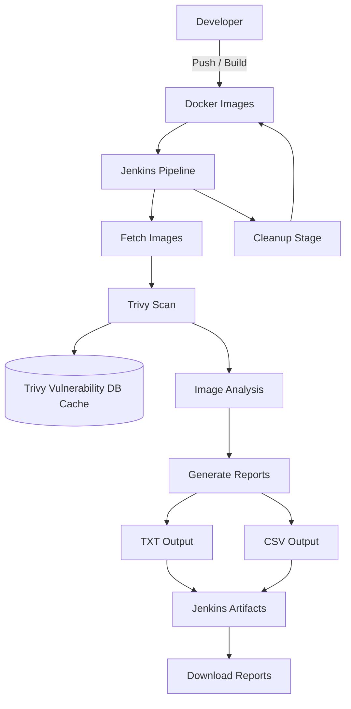

## 🚀 Overview

In modern cloud-native development, container images often bundle outdated libraries and OS packages. This project solves that by integrating an automated security gate that:
* **Identifies OS-level vulnerabilities** (CVEs).
* **Scans Language-specific dependencies** (including Java via Trivy DB).
* **Generates audit-ready reports** in both human-readable (Table) and machine-readable (CSV) formats.

## 🛠️ Tech Stack
* **Orchestration:** Jenkins (Declarative Pipeline)
* **Security Scanner:** [Trivy](https://github.com/aquasecurity/trivy)
* **Containerization:** Docker
* **Environment:** Ubuntu 24.04 LTS (VirtualBox)

## 🔧 Pipeline Architecture



> This pipeline demonstrates a practical DevSecOps workflow where container images are continuously scanned for vulnerabilities, helping surface security risks early in the CI/CD lifecycle.

The `Jenkinsfile` is designed for efficiency and persistence:
1.  **Environment Setup:** Initializes persistent cache directories (`/var/lib/jenkins/.trivy`) to optimize scan speeds.
2.  **DB Management:** Downloads and initializes the Trivy Vulnerability and Java databases, then reuses the local cache for faster subsequent scans.
3.  **Dynamic Discovery:** Automatically detects all local Docker images using `docker images --format` to ensure no container goes unscanned.
4.  **Security Gating:** Filters for `HIGH` and `CRITICAL` vulnerabilities to focus on actionable risks.
5.  **Artifact Archiving:** Stores results directly in the Jenkins build history for compliance tracking.

## 📋 Configuration

To use this pipeline, ensure your Jenkins agent has:
* **Docker** installed and the `jenkins` user added to the `docker` group.
* **Trivy** binary installed.
* Write permissions to `/var/lib/jenkins/` for the persistent cache.

### Jenkins Environment Variables:
```groovy
environment {
    TRIVY_CACHE_DIR = "/var/lib/jenkins/.trivy"
    TMPDIR = "/var/lib/jenkins/tmp"
}
```

## 📊 Sample Output

When the pipeline executes, it generates a summary in the console and archives detailed reports. A typical scan results in:

| Severity     | Status            |
|--------------|-------------------|
| CRITICAL     | Action Required   |
| HIGH         | Review Required   |
| MEDIUM / LOW | Monitored         |

> **Performance Note:** The pipeline skips DB updates during the scan loop (`--skip-db-update`, `--skip-java-db-update`) to reduce execution time by relying on the pre-initialized local cache.

## 📂 Project Structure

- **Jenkinsfile**: Pipeline-as-code configuration
- **README.md**: Project documentation
- **reports/**: Sample `.txt` and `.csv` vulnerability reports

## 📄 Sample Reports

Sample outputs are included in the `reports/` directory:

- `sample-image-report.txt` – Human-readable vulnerability summary
- `sample-image-report.csv` – Structured output for further analysis

These files demonstrate how vulnerabilities are reported and can be used for auditing or integration with other tools.
