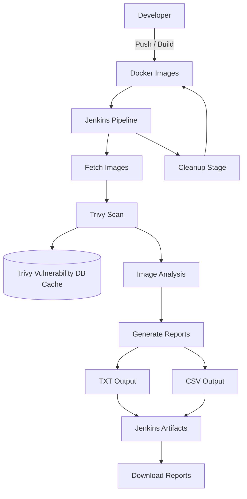

## 🚀 Overview

In modern cloud-native development, container images often bundle outdated libraries and OS packages. This project solves that by integrating an automated security gate that:
* **Identifies OS-level vulnerabilities** (CVEs).
* **Scans Language-specific dependencies** (specifically targeting Java/BlueOcean environments).
* **Generates audit-ready reports** in both Human-readable (Table) and Machine-readable (CSV) formats.

## 🛠️ Tech Stack
* **Orchestration:** Jenkins (Declarative Pipeline)
* **Security Scanner:** [Trivy](https://github.com/aquasecurity/trivy)
* **Containerization:** Docker
* **Environment:** Ubuntu 24.04 LTS (VirtualBox)

## 🔧 Pipeline Architecture



> This pipeline demonstrates a practical DevSecOps workflow where container images are continuously scanned for vulnerabilities before deployment, ensuring security is integrated early in the CI/CD lifecycle.

The `Jenkinsfile` is designed for efficiency and persistence:
1.  **Environment Setup:** Initializes persistent cache directories (`/var/lib/jenkins/.trivy`) to optimize scan speeds.
2.  **DB Management:** Automatically handles the first-time download and subsequent updates of the Trivy Vulnerability and Java Databases.
3.  **Dynamic Discovery:** Programmatically identifies all local Docker images using `docker images --format` to ensure no container goes unscanned.
4.  **Security Gating:** Filters for `HIGH` and `CRITICAL` vulnerabilities to focus on actionable risks.
5.  **Artifact Archiving:** Stores results directly in the Jenkins build history for compliance tracking.

## 📋 Configuration

To use this pipeline, ensure your Jenkins agent has:
* **Docker** installed and the `jenkins` user added to the `docker` group.
* **Trivy** binary installed.
* Write permissions to `/var/lib/jenkins/` for the persistent cache.

### Jenkins Environment Variables:
```groovy
environment {
    TRIVY_CACHE_DIR = "/var/lib/jenkins/.trivy"
    TMPDIR = "/var/lib/jenkins/tmp"
}
```

## 📊 Sample Output

When the pipeline executes, it generates a summary in the console and archives detailed reports. A typical scan results in:

| Severity     | Status            |
|--------------|-------------------|
| CRITICAL     | Action Required   |
| HIGH         | Review Required   |
| MEDIUM / LOW | Monitored         |

> **Performance Note:** The pipeline is configured to bypass the Java DB update during the scan loop (`--skip-java-db-update`) to save bandwidth and reduce build times, utilizing the pre-synchronized local cache.

---

## 📂 Project Structure

- **Jenkinsfile**: The complete pipeline-as-code configuration.
- **reports/**: *(Generated)* Contains `.txt` and `.csv` security audits for each scanned image.
